<h1 align="center">Musique</h1>

[View the live website here.](https://xnaavii.github.io/musique/)

## Project Rationale

This is an music website where user can connect and join communities based on what they listen to. Users can also attend events and explore new music.

<h2 align="center"></h2>

## CONTENTS

* [User Experience](#user-experience-ux)
  * [User Stories](#user-stories)

* [Design](#design)
  * [Colour Scheme](#colour-scheme)
  * [Typography](#typography)
  * [Imagery](#imagery)
  * [Wireframes](#wireframes)

* [Features](#features)
  * [General Features on Each Page](#all-pages)
  * [Home Page](#home-page)
  * [About Us Page](#about-us)
  * [Register Page](#register-page)
  * [Sign In](#sign-in)

* [Technologies Used](#technologies-used)
  * [Languages Used](#languages-used)
  * [Frameworks, Libraries & Programs Used](#frameworks-libraries--programs-used)

* [Testing](#testing)
  * [Code Validation](#code-validation)
  * [Accessibility and Performance Test](#accessibility-performance-test)
  * [Feature Testing](#feature-testing)
  * [Browser Support Testing](#browser-support-testing)
  * [Device compatibility](#device-compatibility)
  * [Tools Testing](#tools-testing)

* [Bugs](#bugs)

* [Deployment](#deployment)
  * [Finished Product]()
  * [GitHub Pages](#github-pages)

* [Credits](#credits)
  * [Code](#code)
  * [Content](#content)
  * [Media](#media)
  * [Acknowledgements](#acknowledgements)

## User Experience (UX) <h5>[Back To top](#contents)</h5>

* ### User stories

* #### First Time Visitor Goals

  * As a First Time Visitor, I want to easily understand the main purpose of the site and learn more how can I find a community.
  * As a First Time Visitor, I want to be able to easily navigate throughout the site to find content.

* #### Returning Visitor Goals

  * As a Returning Visitor, I want to explore new music.
  * As a Returning Visitor, I want to find events and meet people with the same taste in music.

## Design <h5>[Back To top](#contents)</h5>

* ### Colour Scheme

  * The color palette

* ### Typography

  * The fonts used are 'Libre Baskerville' for headings and 'Raleway' for text; 'sans-serif' as a fallback font.

* ### Imagery

  * Images were chosen in regards to the topic of the website; meaning that they were chosen to be minimalistic, related to the page content.

* ### Wireframes

    I created wireframes using the wireframe [Balsamiq](https://balsamiq.com/wireframes/desktop/#) website.

Page | Desktop Version | Mobile Version
 --- | --- | ---
Home Page |  | 

## Features <h5>[Back To top](#contents)</h5>

### All Pages

* ### Navbar

  * Navbar offers up four links to help the user navigate through the site and it has underline when hovered over or while active.
  * Navbar is inside of a burger icon and when toggled it expands with the list of pages so that the user can navigate through the site.

* ### Footer

  * The footer offers an array of social media links which when selected, takes user to the desired site.
  * When hovered, icons are expected to scale and change color.

* ### Home page

* Upper Section
  * Aims to display 'Artist of the week' with embedded YouTube video and below that streaming icons which are related. Embedded video is not automatically played and allows user to play if desired.
  * Streaming icons under the video allow user to select the preferred music platform and when clicked, user is taken there   (opens in a new tab).
  * Icons are expected to scale and have their opacity reduced when hovered over.

* Lower Section
  * 'Trending Community' part of the section with the display of top three trending artist communities.
  * Hover effect where buttons change their appearance to darker color is expected when user is hovering over them. When clicked, user is taken to desired community.
  * 'More' button takes user to registration page and it contains hover effect as mentioned above.

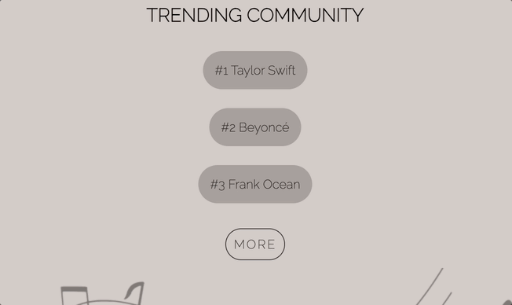

* ### About Us page

  * About Us page offers brief description of what site stands for and below that three icons with each of them representing site goals (Explore Music, Join a Community, Find events).
  * Topic buttons are expected to have hover effect and change color.
  * When clicked on 'Explore Music', user is taken to home page.
  * When clicked on 'Join a community' user is taken to registration page..
  * When clicked on 'Join events' user is taken to Ticketmaster site

* ### Register page

  * Register page contains a register form where user can register and 'already a member' link below where user can be transferred to sign in page.
  * Each field is required to be filled and when active it has a border around.
  * Register button is expected to change colour when hovered over.

* ### Sign in

  * Sign in page contains a form with a sign in button and 'Join Musique' link below if new to the platform.
  * Each field is required to be filled and when active it has a border around.
  * Sign in button is expected to change color when hovered over.

## Technologies Used <h5>[Back To top](#contents)</h5>

### Languages Used

* [HTML5](https://en.wikipedia.org/wiki/HTML5)
* [CSS3](https://en.wikipedia.org/wiki/Cascading_Style_Sheets)

### Frameworks, Libraries & Programs Used

* [Google Fonts:](https://fonts.google.com/)
  * Google fonts were used to import the 'Libre Baskerville' and 'Raleway' font into the style.css file which is used on all pages throughout the project.
* [Git](https://git-scm.com/)
  * Git was used for version control by utilizing the Gitpod terminal to commit to Git and Push to GitHub.
* [GitHub:](https://github.com/)
  * GitHub is used to store the projects code after being pushed from Git.
* [Balsamiq](https://balsamiq.com/wireframes/desktop/#)
  * Balsamiq was used to create the [wireframes](#wireframes) during the design process.

## Testing  <h5>[Back To top](#contents)</h5>

### Code Validation

The W3C Markup Validator and W3C CSS Validator Services were used to validate every page of the project to ensure there were no syntax errors in the project.

* [W3C Markup Validator](https://jigsaw.w3.org/css-validator/#validate_by_input)
  * W3C Markup Validator returned series of info, header warning and a button error which were all later resolved.

* [W3C CSS Validator](https://jigsaw.w3.org/css-validator/#validate_by_input)
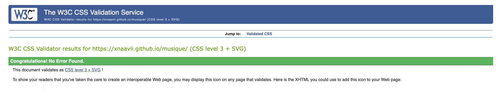

### Accessibility and Performance Test

* Used Lighthouse in Chrome DevTools to confirm that the colors and fonts being used in throghout the website are easy to read and accessible.
* Lighthouse reports
  * Desktop Results
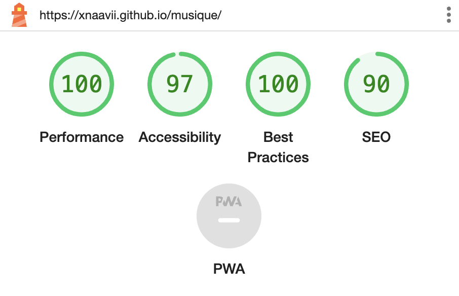
  * Mobile Results

### Feature Testing

* Common Elements Testing

  * General

    Feature | Outcome | Pass/Fail
    --- | --- | ---
    Navigation Bar | Hover effect and links are working as expected. | Pass
    Footer Social Links | Hover effect and open the specific website in a new tab. | Pass

  * Home Page

    Feature | Outcome | Pass/Fail
    --- | --- | ---
    YouTube Video | Plays when user interacts. | Pass
    Streaming Icons | Hover effect and open the specific streaming platform in a new tab. | Pass
    Trending Community List | Hover effect and open the specific community page in a new tab. | Pass
    'More' Link | Hover effect and take user to registration page. | Pass

  * About Us Page

    Feature | Outcome | Pass/Fail
    --- | --- | ---
    Explore Music Link | Hover effect and links are working as expected. |  Pass
    Join a Community Link |  Hover effect and links are working as expected. |  Pass
    Find Events Link |  Hover effect and links are working as expected. | Pass

  * Register/Sign In Page

    Feature | Outcome | Pass/Fail
    --- | --- | ---
    Register From | Require all fields in the right format before submission. |  Pass
    Sign In Field | Require all fields in the right format before submission. |  Pass
    Sign In/Sign Up link | Hover effect and submit work as expected. | Pass
    Already a member| Hover effect and takes user to sign in page. | Pass
    Join Musique Link | Hover effect and takes user to registration page. | Pass

### Browser Support Testing

| Device/Browser | Expected Performance | Testing Performed | Result |
| --- | --- | --- | --- |
| Google Chrome | Full functionality of external and internal links as well as full functionality of the form element. | Tested all features, links, video and form. | Passed with full functionality. |
|  |  |  |  |
| Safari | Full functionality of external and internal links as well as full functionality of the form element. | Tested all features, links, video and form. | Passed with full functionality. |
|  |  |  |  |
| Internet Explorer | Full functionality of external and internal links as well as full functionality of the form element. | Tested all features, links, video and form. | Passed with full functionality. |
|  |  |  |  |
| Microsoft Edge | Full functionality of external and internal links as well as full functionality of the form element. | Tested all features, links, video and form. | Passed with full functionality. |
|  |  |  |  |

### Device compatibility

Device | Outcome | Pass/Fail
--- | --- | ---
MacBook M2 Air 13.6' | No appearance, responsiveness nor functionality issues. | Pass
HP Chromebook 14' | No appearance, responsiveness nor functionality issues. | Pass
Samsung Galaxy S20 Ultra | No appearance, responsiveness nor functionality issues. | Pass
iPad Air | No appearance, responsiveness nor functionality issues. | Pass
iPad Mini | No appearance, responsiveness nor functionality issues. | Pass
iPhone 12 Mini | No appearance, responsiveness nor functionality issues. | Pass
iPhone 13 Mini | No appearance, responsiveness nor functionality issues. | Pass
iPhone 14 Pro Max | No appearance, responsiveness nor functionality issues. | Pass

### Tools Testing

* [Chrome DevTools](https://developer.chrome.com/docs/devtools/)

  * Chrome DevTools was used during the development process to test, explore and modify HTML elements and CSS styles used in the project.

## Finished Product <h5>[Back To top](#contents)</h5>

Page | Desktop | Mobile
--- | --- | ---
Home Page | 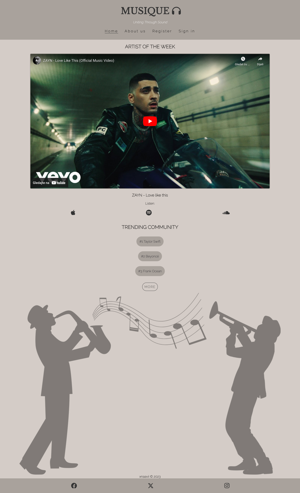 | 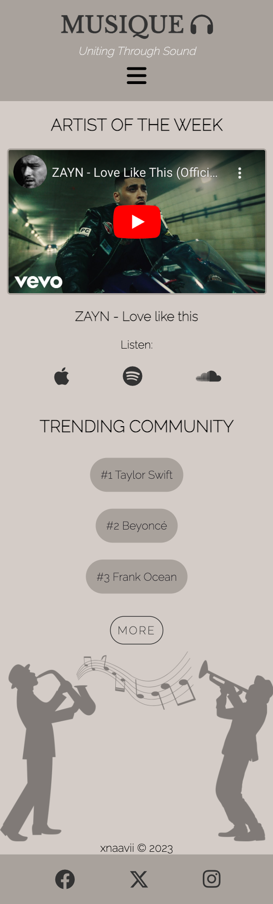
About Us | 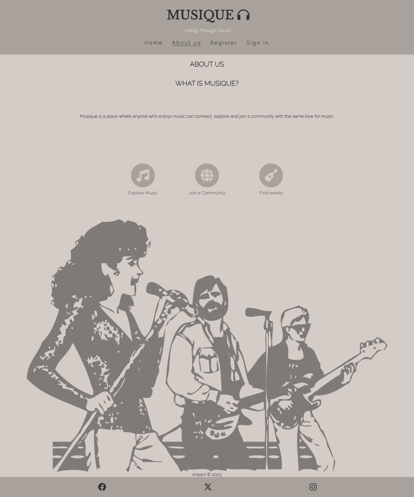 | 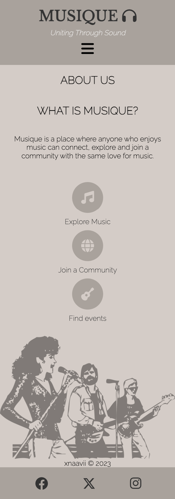
Register | 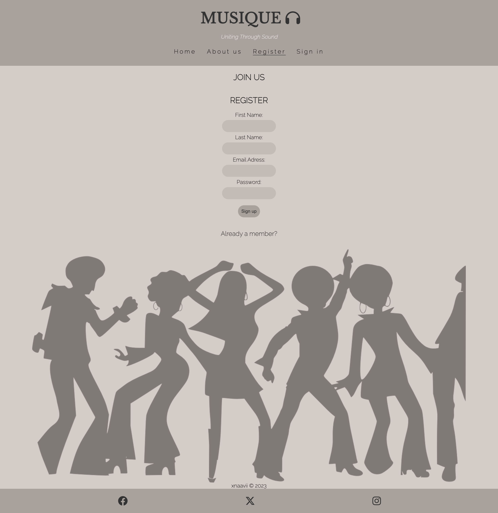 | 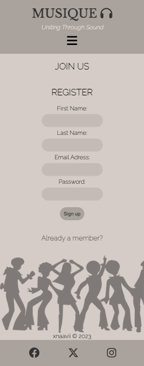
Sign In | 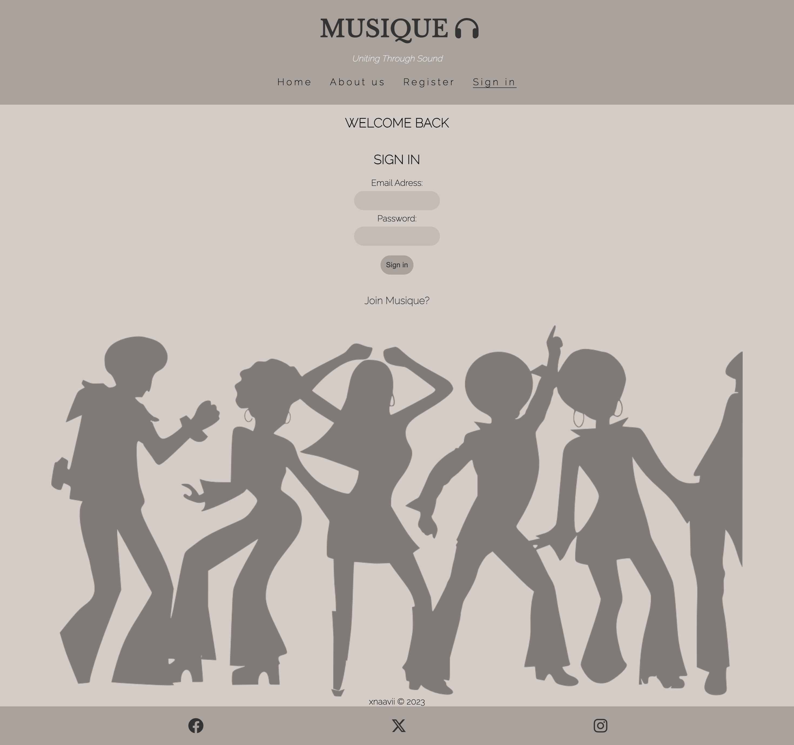 | 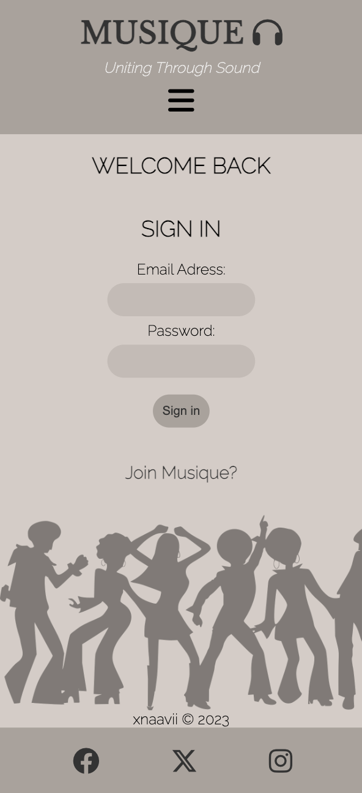

## Deployment <h5>[Back To top](#contents)</h5>

### GitHub Pages

The project was deployed to GitHub Pages using the following steps:

1. Log in to GitHub and locate the GitHub Repository
2. At the top of the Repository (not top of page), locate the "Settings" Button on the menu.
3. Scroll down the Settings page until you locate the "GitHub Pages" Section.
4. Under "Source", click the dropdown called "None" and select "Master Branch".
5. The page will automatically refresh.
6. Scroll back down through the page to locate the now published site in the "GitHub Pages" section.

## Credits <h5>[Back To top](#contents)</h5>

### Code

* [Stack Overflow](https://stackoverflow.com/), [CSS-Tricks](https://css-tricks.com/) and [W3Schools](https://www.w3schools.com/) were consulted on a regular basis for inspiration and sometimes to be able to better understand the code being implement.
* [Youtube](https://www.youtube.com/watch?v=oLgtucwjVII&t=151s) guidance on how to create the navbar.

### Content

* Content was created by the developer.

### Media

* Images were taken from [Pixabay](https://pixabay.com/).

### Acknowledgements

* My mentor, Marcel, for his invaluable feedback and guidance.

* My friends for their impeccable vision and testing.
