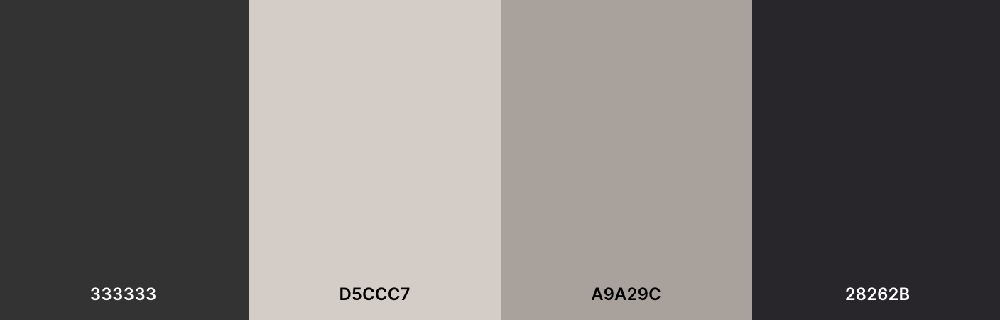
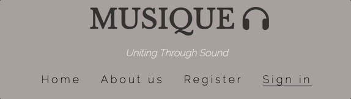
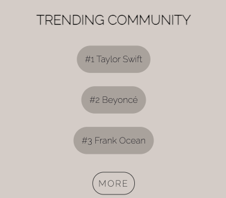
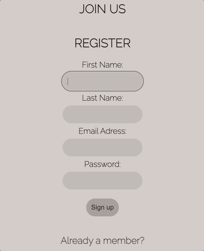

<h1 align="center">Musique</h1>

[View the live website here.](https://xnaavii.github.io/musique/)

## Project Rationale

This is an music website where user can connect and join communities based on what they listen to. Users can also attend events and explore new music.

<h2 align="center"></h2>

## CONTENTS

* [User Experience](#user-experience-ux)
  * [User Stories](#user-stories)

* [Design](#design)
  * [Colour Scheme](#colour-scheme)
  * [Typography](#typography)
  * [Imagery](#imagery)
  * [Wireframes](#wireframes)

* [Features](#features)
  * [General Features on Each Page](#all-pages)
  * [Home Page](#home-page)
  * [About Us Page](#about-us)
  * [Register Page](#register)
  * [Sign In](#sign-in)

* [Technologies Used](#technologies-used)
  * [Languages Used](#languages-used)
  * [Frameworks, Libraries & Programs Used](#frameworks-libraries--programs-used)

* [Testing](#testing)
  * [Code Validation](#code-validation)
  * [Accessibility Test](#accessibility-test)
  * [Performance Test](#performance-test)
  * [Feature Testing](#feature-testing)
  * [Browser Support Testing](#browser-support-testing)

* [Bugs](#bugs)

* [Deployment](#deployment)
  * [GitHub Pages](#github-pages)

* [SEO](#seo)

* [Credits](#credits)
  * [Code](#code)
  * [Content](#content)
  * [Media](#media)
  * [Acknowledgements](#acknowledgements)

## User Experience (UX) <h5>[Back To top](#contents)</h5>

* ### User stories

* #### First Time Visitor Goals

  * As a First Time Visitor, I want to easily understand the main purpose of the site and learn more how can I find a community.
  * As a First Time Visitor, I want to be able to easily navigate throughout the site to find content.

* #### Returning Visitor Goals

  * As a Returning Visitor, I want to explore new music.
  * As a Returning Visitor, I want to find events and meet people with the same taste in music.

## Design <h5>[Back To top](#contents)</h5>

* ### Colour Scheme

  * The color pallete

* ### Typography

  * The fonts used are 'Libre Baskerville' for headings and 'Raleway' for text; 'sans-serif' as a fallback font.

* ### Imagery

  * Images were chosen in regards to the topic of the website; meaning that they were chosen to be minimalistic, related to the page content.

* ### Wireframes

    I created wireframes using the wireframe [Balsamiq](https://balsamiq.com/wireframes/desktop/#) website.
    Final product looks different than the initial wireframe.

Page | Desktop Version | Mobile Version
 --- | --- | ---
Home Page |  | 

## Features <h5>[Back To top](#contents)</h5>

### All Pages

* ### Navbar

  * Navbar offers up four links to help the user navigate through the site and it has underline when hovered over or while active.
<h3 align="center"></h3>
<h3 align="center"></h3>

  * Navbar is inside of a burger icon and when toggled it expands with the list of pages so that the user can navigate through the site.

<h3 align="center"></h3>
<h3 align="center"></h3>

* ### Footer

  * The footer offers an array of social media links which when selected, takes user to the desired site.
  * When hovered, icons are expected to scale and change color.
<h3></h3>
assets/readme-files/footer-interaction.gif

* ### Home page

  * Aims to display 'Artist of the week' with embedded YouTube video and below that streaming icons which are related. Embedded video is not automatically played and allows user to play if desired.
  * Streaming icons under the video allow user to select the preferred music platform and when clicked, user is taken there (opens in a new tab).
  * Icons are expected to scale and have their opacity reduced when hovered over.

  * 'Trending Community' part of the section with the display of top three trending artist communities.
  * Hover effect where buttons change their appearance to darker color is expected when user is hovering over them. When clicked, user is taken to desired community.
  * 'More' button takes user to registration page and it contains hover effect as mentioned above.

* ### About Us page

  * About Us page offers brief description of what site stands for and below that three icons with each of them respresenting site goals (Explore Music, Join a Community, Find events).
  * When clicked on 'Explore Music', user is taken to home page.
  * When clicked on 'Join a community' user is taken to registration page..
  * When clicked on 'Join events' user is taken to ticketmaster site

* ### Register page

  * Register page contains a register form where user can register and 'already a member' link below where user can be transferred to sign in page.
  * Each field is required to be filled and when active it has a border around. 
  * Registed button is expected to change color when hovered over.

* ### Sign in

  * Sign in page contains a form with a sign in button and 'Join Musique' link below if new to the plaform.
  * Each field is required to be filled and when active it has a border around.
  * Sign in button is expected to change color when hovered over.

## Technologies Used <h5>[Back To top](#contents)</h5>

### Languages Used

* [HTML5](https://en.wikipedia.org/wiki/HTML5)
* [CSS3](https://en.wikipedia.org/wiki/Cascading_Style_Sheets)

### Frameworks, Libraries & Programs Used

* [Google Fonts:](https://fonts.google.com/)
  * Google fonts were used to import the 'Libre Baskerville and Raleway' font into the style.css file which is used on all pages throughout the project.
* [Git](https://git-scm.com/)
  * Git was used for version control by utilizing the Gitpod terminal to commit to Git and Push to GitHub.
* [GitHub:](https://github.com/)
  * GitHub is used to store the projects code after being pushed from Git.
* [Balsamiq](https://balsamiq.com/wireframes/desktop/#)
  * Balsamiq was used to create the [wireframes](#wireframes) during the design process.

## Testing  <h5>[Back To top](#contents)</h5>

### Code Validation

The W3C Markup Validator and W3C CSS Validator Services were used to validate every page of the project to ensure there were no syntax errors in the project.

* [W3C Markup Validator](https://jigsaw.w3.org/css-validator/#validate_by_input)
  * W3C Markup Validator returned series of info, header warning and a button error which was all resolved.

* [W3C CSS Validator](https://jigsaw.w3.org/css-validator/#validate_by_input)

### Accessibility Test

### Performance Test

### Feature Testing

### Browser Support Testing

## Bugs <h5>[Back To top](#contents)</h5>

### Known Bugs

### Fixed Bugs

## Deployment <h5>[Back To top](#contents)</h5>

### GitHub Pages

The project was deployed to GitHub Pages using the following steps:

1. Log in to GitHub and locate the GitHub Repository
2. At the top of the Repository (not top of page), locate the "Settings" Button on the menu.
3. Scroll down the Settings page until you locate the "GitHub Pages" Section.
4. Under "Source", click the dropdown called "None" and select "Master Branch".
5. The page will automatically refresh.
6. Scroll back down through the page to locate the now published site in the "GitHub Pages" section.

## SEO <h5>[Back To top](#contents)</h5>

## Credits <h5>[Back To top](#contents)</h5>

### Code

* All code came from the developer.

### Content

### Media

### Acknowledgements
